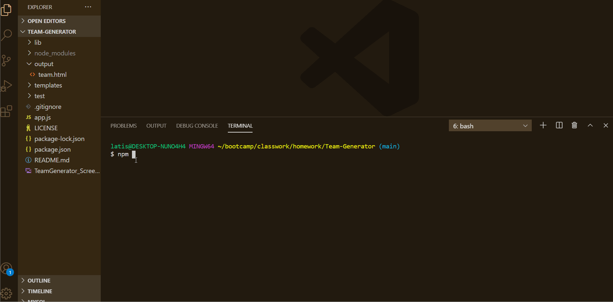

# Team-Generator

# Table of Contents

  1. [Description](#Description)
  2. [Technology Used](#TechnologyUsed)
  3. [Installation](#Installation)
  4. [Instructions For Use](#InstructionsForUse)
  5. [License](#License)
  6. [Walkthrough Video](#WalkthroughVideo)
  7. [Screenshot](#Screenshot)
  8. [Questions](#Questions)

## DESCRIPTION
• This is a software engineering team generator command line interface (CLI) application that creates a well, structured file based on user inputs.  

## TECHNOLOGY USED
• JavaScript
• Inquirer
• Node

## INSTALLATION
• Fork this repo and clone to your computer. Next, run 'npm install' to install all the dependencies listed in package.JSON file.

## INSTRUCTIONS FOR USE
• Open your terminal and navigate to the root directory of this project. Next, run the command - 'node index.js'. The application will prompt the user for information about the team manager and then information about the team members. The user can input any number of team members, and they may be a mix of engineers and interns.

## LICENSE

## WALKTHROUGH VIDEO
• The included image demonstrates the application functionality:

## SCREENSHOT

## QUESTIONS
• If you have any questions, concerns or suggestions please feel free to contact me with the link below.
GitHub: "https://github.com/lmmccullum"
